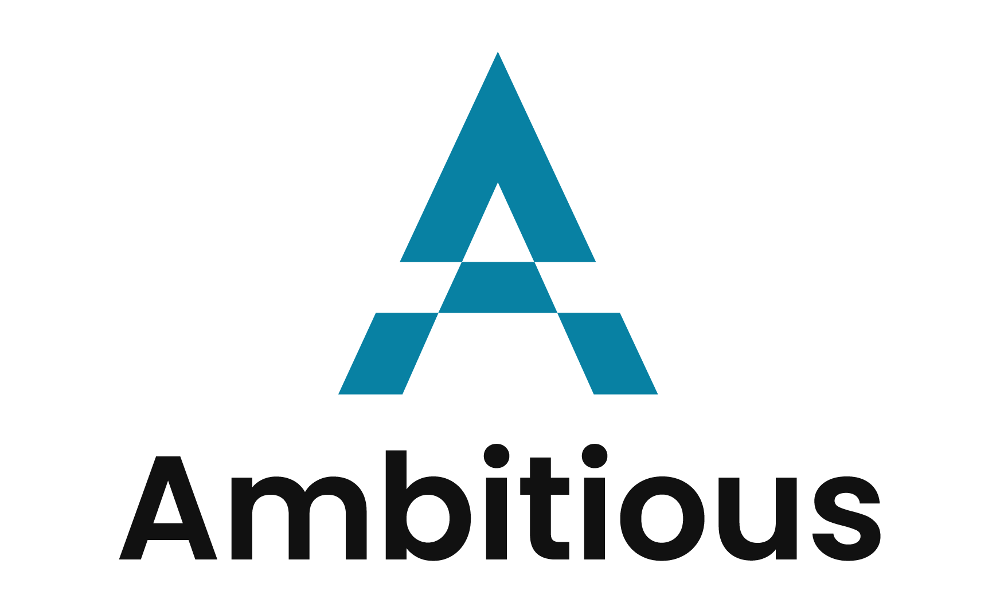
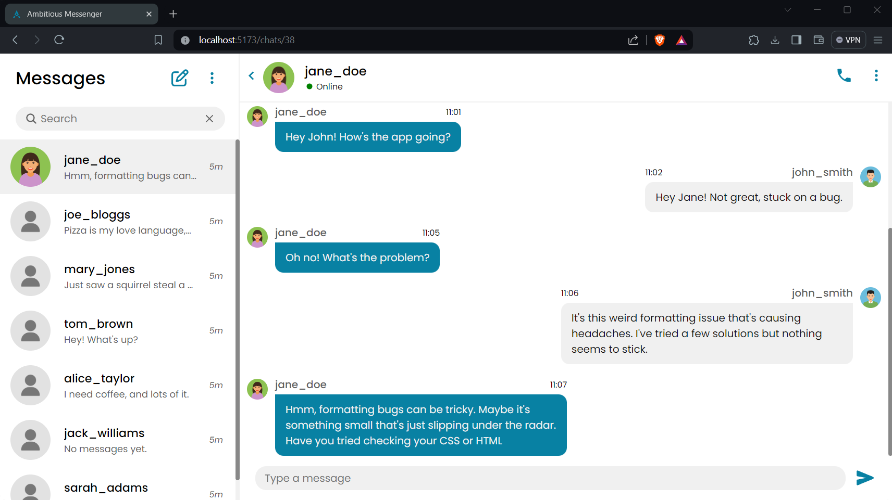

    

### A Modern Web Messaging Application

Started out as a group project during our Web Application Architectures module at TU Dublin, alongside two classmates. Then came the inevitable urge to polish it up whenever the stars aligned and time permitted (spoiler alert: it's not always easy to find that time).

_Still a work in progress... because perfection takes time, and so does debugging._

## Screenshots 📸

Here's a little demo sneak peek:

    

_More screenshots comming soon._

## Features💡

- **User Authentication**: Register, login and logout mechanisms for secure access.
- **Friends Network**: Send, receive, accept or decline friend requests.
- **Real-time Chat**: Text communication between two users via websockets.

_More features coming soon._

## Tech stack 🛠️

- [React](https://react.dev/) & [Redux](https://redux.js.org/)
- [Express](https://expressjs.com/)
- [Prisma ORM](https://www.prisma.io/)
- [PostgreSQL](https://www.postgresql.org/)
